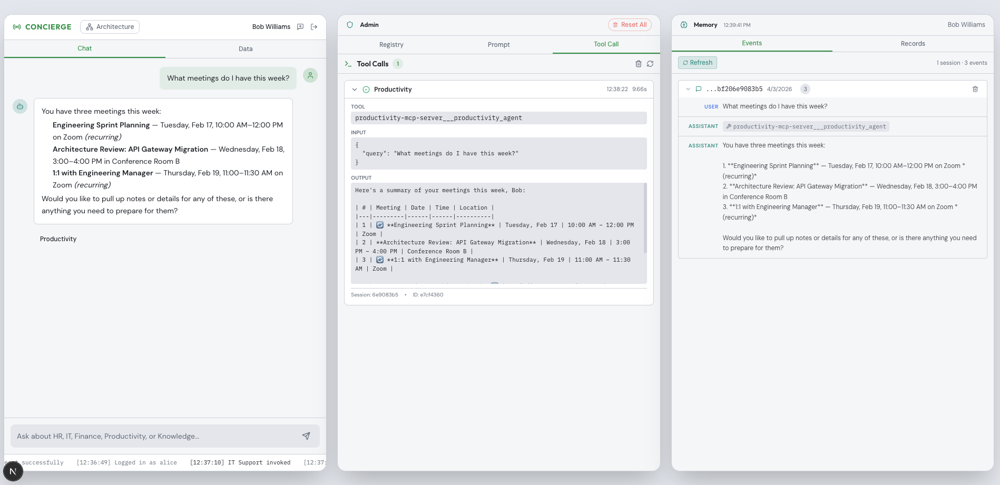
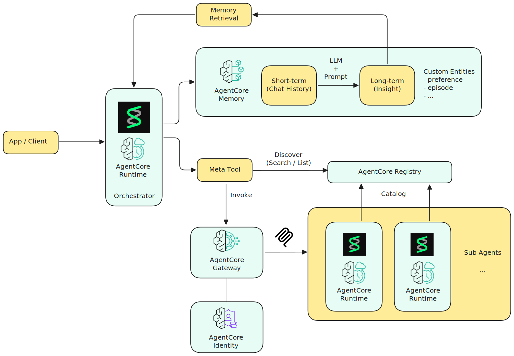
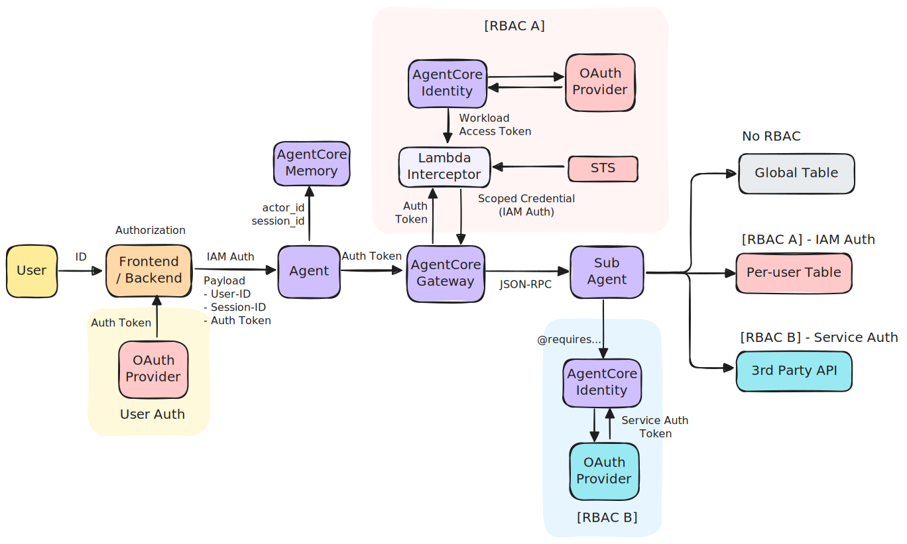

# Multi-Agent Concierge on Amazon Bedrock AgentCore

A reference implementation of a multi-agent enterprise assistant built on [Amazon Bedrock AgentCore](https://aws.amazon.com/bedrock/agentcore/). A central orchestrator coordinates five domain-specialist sub-agents, each deployed as an isolated MCP runtime, with a managed gateway handling tool discovery and authentication, IAM-level RBAC enforcing per-user data access, and a shared memory service maintaining conversation context.



## Architecture

The system is composed of four principal layers:

| Layer | Service | Role |
|-------|---------|------|
| **Orchestrator** | AgentCore Runtime (HTTP) | Entry point for all user interactions. Hosts a [Strands](https://github.com/strands-agents/sdk-python) agent that routes requests, calls sub-agents via the Gateway, and owns the Memory session. |
| **Gateway** | AgentCore Gateway (MCP) | Aggregates all sub-agent tools into a single MCP endpoint. Handles JWT validation, semantic tool search, request routing, and OAuth2 machine-to-machine auth. |
| **Sub-agents** | AgentCore Runtime (MCP) x 5 | Independent, stateless MCP runtimes — one per business domain. Each exposes domain-specific tools and receives user context transparently via Gateway injection. |
| **Data** | DynamoDB + IAM RBAC | Per-user data table with IAM LeadingKeys condition. Scoped credentials are injected per-request so each user can only access their own partition. |
| **Identity** | AgentCore Identity | Provider-agnostic identity abstraction. Exchanges user JWTs for workload access tokens, decoupling the system from any specific OAuth provider. |
| **Memory** | AgentCore Memory | Stores short-term conversation events and asynchronously extracts long-term records (user preferences, semantic facts) with no custom infrastructure. |



### Request Flow

1. User selects a demo identity in the frontend (alice, bob, or charlie)
2. Frontend authenticates against Cognito and receives a JWT access token
3. Frontend invokes Orchestrator Runtime via IAM Auth, passing JWT, user ID, and session ID in the request payload
4. Orchestrator stores the message as a short-term memory event (`actor_id` + `session_id`)
5. Orchestrator calls Gateway `tools/list` to discover available sub-agents
6. Agent selects the appropriate sub-agent and calls `tools/call` via the Gateway, forwarding the user JWT
7. Gateway validates the JWT (`CUSTOM_JWT` authorizer) and forwards the request to the Interceptor Lambda
8. Interceptor Lambda:
   - Exchanges the user JWT for a workload access token via AgentCore Identity
   - Extracts user identity from JWT claims (OIDC standard `sub`, `username`)
   - Assumes a scoped IAM role with `user_id` session tag via STS
   - Injects user identity + scoped AWS credentials into the JSON-RPC `params.arguments`
9. Gateway routes the call to the target sub-agent with an M2M token (OAuth2 `client_credentials`)
10. Sub-agent's `UserContextMiddleware` extracts injected fields into `ContextVar` and strips them from the body before tool handlers run
11. Tool functions use the scoped credentials to query DynamoDB — IAM LeadingKeys condition ensures only the authenticated user's data is accessible
12. Orchestrator streams the response to the frontend via SSE
13. Memory asynchronously extracts long-term records in the background

---

## Project Structure

```
.
├── agents/
│   ├── orchestrator/          # Concierge orchestrator (Strands Agent + FastAPI)
│   └── components/
│       ├── hr/                # HR sub-agent (PTO, performance, onboarding)
│       ├── it-support/        # IT Support sub-agent (tickets, software, equipment)
│       ├── finance/           # Finance sub-agent (expenses, budgets, invoices)
│       ├── productivity/      # Productivity sub-agent (calendar, docs, meetings)
│       ├── knowledge/         # Knowledge sub-agent (policies, handbook, office info)
│       └── shared/            # Shared middleware, DynamoDB client, user context
├── infra/                     # CDK infrastructure (TypeScript)
│   ├── lib/
│   │   ├── auth-stack.ts      # Cognito + OAuth2 credential provider + Workload Identity
│   │   ├── data-stack.ts      # DynamoDB tables + scoped IAM role (RBAC)
│   │   ├── component-runtime-stack.ts  # Sub-agent runtime stacks
│   │   ├── gateway-stack.ts   # AgentCore Gateway + Interceptor Lambda
│   │   └── runtime-stack.ts   # Orchestrator runtime + AgentCore Memory
│   └── lambda/
│       ├── gateway-interceptor/  # JWT decode, STS AssumeRole, credential injection
│       └── data-seeder/          # Populates DynamoDB with demo fixture data
├── frontend/                  # Next.js 15 dashboard
└── deploy.sh                  # Interactive deployment script
```

---

## Sub-agents

| Agent | Domain | Key Tools |
|-------|--------|-----------|
| **HR** | Human Resources | PTO balances, leave requests, performance reviews, open positions, onboarding |
| **IT Support** | IT Operations | Support tickets, software access, equipment inventory, service status |
| **Finance** | Finance | Expense reports, department budgets, invoice management |
| **Productivity** | Productivity | Calendar events, document management, meeting notes |
| **Knowledge** | Company Knowledge | Policies, employee handbook, office locations |

Each sub-agent is deployed as a separate AgentCore MCP Runtime. Sub-agents are stateless — all conversation context lives in the Orchestrator's Memory session.

---

## Prerequisites

- AWS CLI configured (`aws configure` or SSO)
- Node.js 18+ and npm
- Docker (for CDK asset bundling)
- Python 3.11+
- AWS CDK v2 (`npm install -g aws-cdk`)
- Region: `us-west-2` (AgentCore is available in select regions)

---

## Deployment

Use the interactive deployment script from the project root:

```bash
./deploy.sh
```

```
  1) Auth               (Cognito, OAuth2 credential provider, Workload Identity)
  2) Data               (DynamoDB tables + RBAC IAM role)
  3) Sub-Agents         (5 domain agents)
  4) Gateway            (MCP Gateway with 5 MCP targets)
  5) Orchestrator       (Concierge agent runtime with Memory)
  6) Full Stack         (All components — phased deployment)
```

Select **6) Full Stack** for a fresh deployment. The script deploys in the correct order:

```
Phase 1:   Auth         → Cognito, credential provider, Workload Identity, demo users
Phase 1.5: Data         → DynamoDB tables, scoped IAM role, fixture data seed
Phase 2:   Sub-agents   → 5 MCP runtimes (reads auth + data SSM)
Phase 3:   Gateway      → MCP Gateway + Interceptor Lambda (reads auth + runtime + data SSM)
Phase 4:   Orchestrator → Concierge agent + Memory (reads gateway SSM)
```

Stacks communicate via SSM Parameter Store — no CloudFormation cross-stack dependencies.

> **CDK Bootstrap**: If deploying for the first time in this account/region, run `cd infra && npx cdk bootstrap` first.

---

## Running the Frontend

```bash
cd frontend
npm install
npm run dev
```

Open [http://localhost:3000](http://localhost:3000). Select one of the demo users from the header:

| Username | Role | Department |
|----------|------|------------|
| `alice` | HR Manager | Human Resources |
| `bob` | Software Engineer | Engineering |
| `charlie` | Business Analyst | Operations |

Each user has their own set of demo data (PTO, expenses, tickets, etc.) stored in DynamoDB. RBAC ensures each user can only access their own data at the IAM level.

---

## CDK Stacks

| Stack | Description |
|-------|-------------|
| `multi-agent-concierge-auth` | Cognito User Pool, OAuth2 Credential Provider, Workload Identity, demo users |
| `multi-agent-concierge-data` | DynamoDB tables (per-user + global), scoped IAM role, fixture data seed |
| `multi-agent-concierge-hr` | HR MCP Runtime (ECR + AgentCore Runtime) |
| `multi-agent-concierge-it-support` | IT Support MCP Runtime |
| `multi-agent-concierge-finance` | Finance MCP Runtime |
| `multi-agent-concierge-productivity` | Productivity MCP Runtime |
| `multi-agent-concierge-knowledge` | Knowledge MCP Runtime |
| `multi-agent-concierge-gateway` | AgentCore Gateway + Interceptor Lambda |
| `multi-agent-concierge-runtime` | Orchestrator Runtime + AgentCore Memory |

---

## Authentication & Access Control



The diagram above shows three distinct auth patterns. This sample implements **User Auth** and **RBAC A**. RBAC B (3rd-party API delegation) is shown for reference but not implemented.

### User Auth (inbound)

The frontend authenticates the user against an OAuth provider (Cognito in this sample) and receives a JWT access token. This token travels through the entire request chain:

1. Frontend → Orchestrator: JWT in the request payload (`auth_token`)
2. Orchestrator → Gateway: JWT as `Authorization: Bearer` header
3. Gateway validates the JWT via `CUSTOM_JWT` authorizer

### RBAC A — IAM-scoped access to AWS resources

After JWT validation, the Gateway Interceptor Lambda converts the user's identity into IAM-scoped credentials for per-user data access:

1. **AgentCore Identity**: exchanges the user JWT for a workload access token (`GetWorkloadAccessTokenForJwt`) — this is the provider-agnostic layer that decouples the system from any specific OAuth provider
2. **JWT decode**: extracts `username` from OIDC standard claims (`preferred_username` → `username` → `email`)
3. **STS AssumeRole + TagSession**: assumes a scoped IAM role with `user_id = username` session tag
4. **Credential injection**: injects scoped AWS credentials into the JSON-RPC `params.arguments`

The sub-agent uses these scoped credentials to query DynamoDB. The IAM policy restricts access to the user's own partition key:

```json
{
  "Condition": {
    "ForAllValues:StringEquals": {
      "dynamodb:LeadingKeys": ["${aws:PrincipalTag/user_id}"]
    }
  }
}
```

The trust policy additionally denies `AssumeRole` if the `user_id` tag is not set — requests without a user context are rejected at the IAM level.

### RBAC B — Delegated access to 3rd-party APIs (not implemented)

In this pattern, the sub-agent uses AgentCore Identity with `@requires_access_token(auth_flow="USER_FEDERATION")` to obtain an OAuth token for a 3rd-party API on behalf of the user. The token is issued by the API's own OAuth provider, not the user's login provider. This is shown in the diagram for architectural completeness.

### Client Auth (outbound)

The Gateway authenticates to sub-agent runtimes using OAuth2 `client_credentials` flow. An `OAuth2CredentialProvider` manages the token lifecycle (refresh, storage) automatically — no custom token management code required in sub-agents.

### DynamoDB table design

| Table | PK | SK | Access |
|-------|----|----|--------|
| `*-user-data` | `username` (alice, bob, charlie) | `DOMAIN#TYPE[#ID]` (e.g., `HR#PTO_BALANCE`, `FIN#EXPENSE#EXP-2026-0551`) | Scoped credentials (RBAC A) |
| `*-global-data` | `CATEGORY#key` (e.g., `POLICY#pto_policy`, `OFFICE#seattle`) | `DETAIL` | Runtime default credentials (no RBAC) |

---

## Key Design Decisions

**Sub-agent as Runtime** — Each domain is an independent container with its own lifecycle. A failure in one sub-agent is contained and does not affect others.

**Stateless sub-agents** — All state lives in the Orchestrator's Memory session. Sub-agents scale horizontally with no shared state.

**IAM-level RBAC over application filtering** — User data isolation is enforced by IAM conditions on DynamoDB, not by query filters in application code. Even if a sub-agent has a bug, it cannot access another user's partition.

**Provider-agnostic identity** — AgentCore Identity abstracts the OAuth provider. Swapping Cognito for Okta or Azure AD requires only updating the OIDC discovery URL, with no code changes.

**JWT injection at the Gateway boundary** — The Interceptor Lambda extracts user identity and scoped AWS credentials from the JWT and injects them as tool arguments. Sub-agents receive user context as plain function parameters — no JWT libraries, STS calls, or token validation code required.

**Optional semantic search** — The Gateway's semantic search can pre-filter tools by relevance before agent reasoning. Togglable per request; increasingly valuable as the number of sub-agents grows.

---

## Production Considerations

This sample is designed for local development and demonstration. For production deployments:

- **Network**: Switch runtimes from `PUBLIC` to VPC network mode with private subnets
- **HTTPS**: Always serve the frontend over HTTPS for non-local deployments
- **Rate Limiting**: Add rate limiting via API Gateway or AWS WAF
- **Credentials**: Replace demo user passwords with a proper identity provider integration
- **CORS**: Configure `ALLOWED_ORIGINS` environment variable on the orchestrator runtime
- **DynamoDB**: Enable point-in-time recovery and consider provisioned capacity for predictable workloads

---

## Security

See [CONTRIBUTING](CONTRIBUTING.md#security-issue-notifications) for more information.

## License

This library is licensed under the MIT-0 License. See the LICENSE file.
