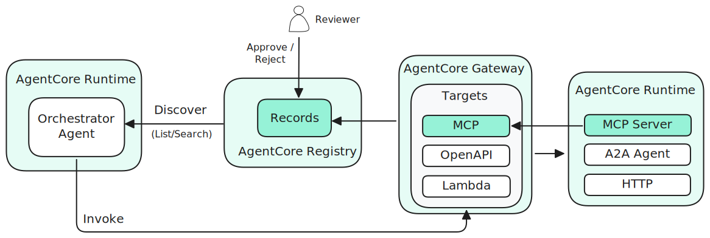
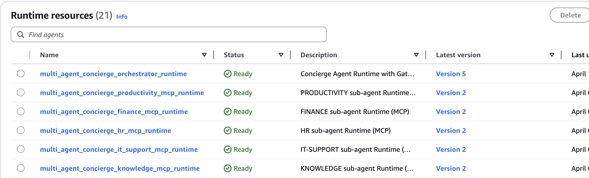
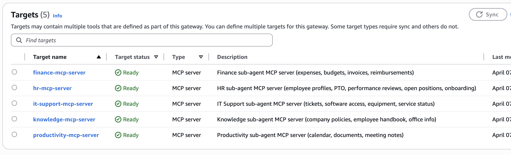
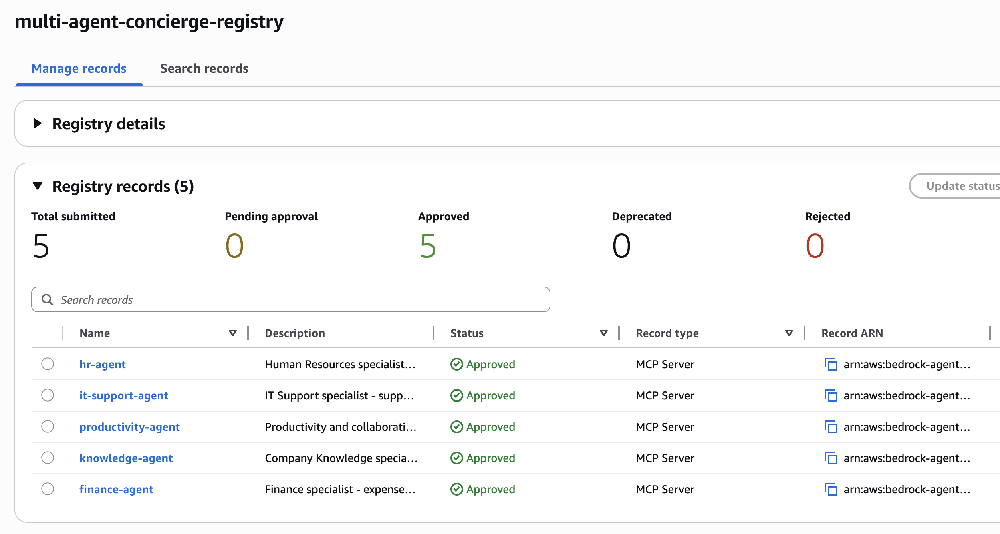

# Multi-Agent Concierge on Amazon Bedrock AgentCore

A reference implementation of a multi-agent enterprise assistant built on [Amazon Bedrock AgentCore](https://aws.amazon.com/bedrock/agentcore/). A central orchestrator coordinates five domain-specialist sub-agents, each deployed as an isolated MCP runtime, with a managed gateway handling authentication and routing, a registry providing semantic agent discovery, IAM-level RBAC enforcing per-user data access, and a shared memory service maintaining conversation context.


## Architecture

The system is composed of six principal layers:

| Layer | Service | Role |
|-------|---------|------|
| **Orchestrator** | AgentCore Runtime (HTTP) | Entry point for all user interactions. Hosts a [Strands](https://github.com/strands-agents/sdk-python) agent that discovers sub-agents from Registry, dynamically generates typed tools, and invokes them through Gateway. Owns the Memory session. |
| **Registry** | AgentCore Registry | Central catalog of all sub-agents with MCP descriptors. Provides semantic search and lifecycle management (approval workflow). The orchestrator discovers available agents and their tool schemas at startup. |
| **Gateway** | AgentCore Gateway (MCP) | Aggregates all sub-agent tools into a single MCP endpoint. Handles JWT validation, request routing, and OAuth2 machine-to-machine auth to sub-agent runtimes. |
| **Sub-agents** | AgentCore Runtime (MCP) x 5 | Independent, stateless MCP runtimes — one per business domain. Each exposes domain-specific tools and receives user context transparently via Gateway injection. |
| **Data** | DynamoDB + IAM RBAC | Per-user data table with role-based IAM conditions. HR_Manager gets full table read; other roles are restricted to their own partition via `LeadingKeys` + `PrincipalTag` conditions. |
| **Identity** | Cognito + AgentCore Identity | Cognito User Pool Groups define roles (HR_Manager, Engineer, Analyst). The `cognito:groups` JWT claim carries the role through the request chain. AgentCore Identity provides provider-agnostic token exchange for outbound API delegation (RBAC B pattern). |
| **Memory** | AgentCore Memory | Stores short-term conversation events and asynchronously extracts long-term records (user preferences, semantic facts) with no custom infrastructure. |


### Meta Tool Pattern

The orchestrator uses a **meta tool** pattern for agent discovery and invocation:

1. **Discovery** — At startup, the orchestrator queries AgentCore Registry to list all approved agents and fetch their MCP tool descriptors (including `inputSchema`).
2. **Dynamic Tool Generation** — For each registered agent, a typed Python tool function is dynamically generated from its `inputSchema`. The LLM sees properly typed parameters (not a generic "query" string).
3. **Invocation** — When the LLM calls a generated tool, the orchestrator opens a temporary MCP session to the Gateway and invokes the corresponding sub-agent tool.
4. **Semantic Search** — When agent count exceeds a configurable threshold, a `search_agents` tool is added for semantic discovery via Registry search API.

This pattern means **adding a new sub-agent requires no orchestrator code changes** — register it in the Registry with an MCP descriptor and the orchestrator picks it up automatically.

### Request Flow

1. User selects a demo identity in the frontend (alice, bob, or charlie)
2. Frontend authenticates against Cognito and receives a JWT access token (includes `agentcore/invoke` scope via Pre Token Generation trigger)
3. Frontend invokes Orchestrator Runtime via IAM Auth, passing JWT, user ID, and session ID in the request payload
4. Orchestrator stores the message as a short-term memory event (`actor_id` + `session_id`)
5. Orchestrator selects the appropriate agent tool (from Registry-discovered catalog) based on the user's query
6. Agent calls the Gateway via MCP `tools/call`, forwarding the user's JWT as `Authorization: Bearer` header
7. Gateway validates the JWT (`CUSTOM_JWT` authorizer) and forwards the request to the Interceptor Lambda
8. Interceptor Lambda:
   - Extracts user identity from JWT claims (OIDC standard `sub`, `username`)
   - Extracts role from `cognito:groups` claim (e.g., `HR_Manager`, `Engineer`)
   - Assumes a scoped IAM role with `user_id` + `role` session tags via STS
   - Injects user identity, role, and scoped AWS credentials into the JSON-RPC `params.arguments`
9. Gateway routes the call to the target sub-agent with an M2M token (OAuth2 `client_credentials`)
10. Sub-agent's `UserContextMiddleware` extracts injected fields into `ContextVar` and strips them from the body before tool handlers run
11. Tool functions use the scoped credentials to query DynamoDB — IAM conditions enforce role-based data scope (HR_Manager reads all partitions; others read only their own)
12. Orchestrator streams the response to the frontend via SSE
13. Memory asynchronously extracts long-term records in the background

---

## Project Structure

```
.
├── agents/
│   ├── orchestrator/          # Concierge orchestrator (Strands Agent + FastAPI)
│   │   └── src/
│   │       ├── agent.py       # Meta tool pattern: Registry discovery + dynamic tool generation
│   │       ├── main.py        # FastAPI service with SSE streaming
│   │       └── gateway/       # Registry client, MCP client, token provider
│   └── components/
│       ├── hr/                # HR sub-agent (PTO, performance, onboarding)
│       ├── it-support/        # IT Support sub-agent (tickets, software, equipment)
│       ├── finance/           # Finance sub-agent (expenses, budgets, invoices)
│       ├── productivity/      # Productivity sub-agent (calendar, docs, meetings)
│       ├── knowledge/         # Knowledge sub-agent (policies, handbook, office info)
│       └── shared/            # Shared middleware, DynamoDB client, user context
├── infra/                     # CDK infrastructure (TypeScript)
│   ├── lib/
│   │   ├── auth-stack.ts      # Cognito + Groups (RBAC roles) + Pre Token Generation + OAuth2 credential provider + Workload Identity
│   │   ├── data-stack.ts      # DynamoDB tables + scoped IAM role (RBAC)
│   │   ├── component-runtime-stack.ts  # Sub-agent runtime stacks
│   │   ├── registry-stack.ts  # AgentCore Registry + agent records (MCP descriptors)
│   │   ├── gateway-stack.ts   # AgentCore Gateway + Interceptor Lambda
│   │   └── runtime-stack.ts   # Orchestrator runtime + AgentCore Memory
│   └── lambda/
│       ├── gateway-interceptor/  # JWT decode, role extraction, STS AssumeRole + TagSession, credential injection
│       ├── registry-manager/     # Custom Resource for Registry lifecycle management
│       └── data-seeder/          # Populates DynamoDB with demo fixture data
├── frontend/                  # Next.js 15 dashboard
└── deploy.sh                  # Interactive deployment script
```

---

## Sub-agents

| Agent | Domain | Key Tools |
|-------|--------|-----------|
| **HR** | Human Resources | PTO balances, leave requests, performance reviews, open positions, onboarding |
| **IT Support** | IT Operations | Support tickets, software access, equipment inventory, service status |
| **Finance** | Finance | Expense reports, department budgets, invoice management |
| **Productivity** | Productivity | Calendar events, document management, meeting notes |
| **Knowledge** | Company Knowledge | Policies, employee handbook, office locations |

Each sub-agent is deployed as a separate AgentCore MCP Runtime and registered in the AgentCore Registry with MCP descriptors (tool schemas, server metadata). Sub-agents are stateless — all conversation context lives in the Orchestrator's Memory session.



### Where Sub-agents Live: Runtime vs Gateway vs Registry

The same five sub-agents appear across three AgentCore resources, each with a distinct role:

| Resource | What it stores | Purpose | Consumed by |
|----------|---------------|---------|-------------|
| **Runtime** | Container image, env vars, IAM role | **Run** the agent | AgentCore platform (scheduling, scaling) |
| **Gateway Target** | Endpoint URL, auth config, protocol | **Route requests** to the agent | Gateway (request forwarding, tool namespacing) |
| **Registry Record** | Tool schemas, descriptions, version | **Discover** the agent | Orchestrator (dynamic tool generation) |

**AgentCore Runtimes** — The compute layer. Each sub-agent is a containerized MCP server that AgentCore schedules and scales. The orchestrator is also a Runtime, but uses HTTP protocol instead of MCP.



**Gateway Targets** — The routing layer. The Gateway aggregates all runtimes behind a single endpoint. Each target maps to one runtime and namespaces its tools (e.g., `hr-mcp-server___hr_agent`). Handles JWT validation, interceptor injection, and M2M auth to runtimes.



**Registry Records** — The catalog layer. Each record holds MCP descriptors with tool `inputSchema`. The orchestrator reads these at startup to dynamically generate typed tool functions — no hardcoded agent interfaces.



The key insight: **removing any one layer breaks the system differently**. Without Runtime, the agent can't execute. Without Gateway, requests can't reach the agent. Without Registry, the orchestrator doesn't know the agent exists.

---

## Prerequisites

- AWS CLI configured (`aws configure` or SSO)
- Node.js 18+ and npm
- Docker (for CDK asset bundling)
- Python 3.11+
- AWS CDK v2 (`npm install -g aws-cdk`)
- Region: `us-west-2` (AgentCore is available in select regions)

---

## Deployment

Use the interactive deployment script from the project root:

```bash
./deploy.sh
```

```
  1) Auth               (Cognito, OAuth2 credential provider, Workload Identity)
  2) Data               (DynamoDB tables + RBAC IAM role)
  3) Sub-Agents         (5 domain agents)
  4) Registry           (Agent catalog with MCP descriptors)
  5) Gateway            (MCP Gateway with 5 MCP targets)
  6) Orchestrator       (Concierge agent runtime with Memory)
  7) Full Stack         (All components — phased deployment)
```

Select **7) Full Stack** for a fresh deployment. The script deploys in the correct order:

```
Phase 1:   Auth         → Cognito, credential provider, Workload Identity, demo users
Phase 1.5: Data         → DynamoDB tables, scoped IAM role, fixture data seed
Phase 2:   Sub-agents   → 5 MCP runtimes (reads auth + data SSM)
Phase 3:   Registry     → Agent catalog + registry records (reads runtime SSM)
Phase 4:   Gateway      → MCP Gateway + Interceptor Lambda (reads auth + runtime + data SSM)
Phase 5:   Orchestrator → Concierge agent + Memory (reads gateway + registry SSM)
```

Stacks communicate via SSM Parameter Store — no CloudFormation cross-stack dependencies.

> **CDK Bootstrap**: If deploying for the first time in this account/region, run `cd infra && npx cdk bootstrap` first.

---

## Running the Frontend

```bash
cd frontend
npm install
npm run dev
```

Open [http://localhost:3000](http://localhost:3000). Select one of the demo users from the header:

| Username | Cognito Group | Role | Department | Data Scope |
|----------|--------------|------|------------|------------|
| `alice` | `HR_Manager` | HR Manager | Human Resources | All users' data (full table read) |
| `bob` | `Engineer` | Software Engineer | Engineering | Own data only |
| `charlie` | `Analyst` | Business Analyst | Operations | Own data only |

Each user has their own set of demo data (PTO, expenses, tickets, etc.) stored in DynamoDB. The Cognito Group determines the IAM data scope — `HR_Manager` can read all users' partitions, while `Engineer` and `Analyst` are restricted to their own partition key.

---

## CDK Stacks

| Stack | Description |
|-------|-------------|
| `multi-agent-concierge-auth` | Cognito User Pool, User Pool Groups (HR_Manager, Engineer, Analyst), Pre Token Generation trigger, OAuth2 Credential Provider, Workload Identity, demo users |
| `multi-agent-concierge-data` | DynamoDB tables (per-user + global), scoped IAM role (role-based data access), fixture data seed |
| `multi-agent-concierge-hr` | HR MCP Runtime (ECR + AgentCore Runtime) |
| `multi-agent-concierge-it-support` | IT Support MCP Runtime |
| `multi-agent-concierge-finance` | Finance MCP Runtime |
| `multi-agent-concierge-productivity` | Productivity MCP Runtime |
| `multi-agent-concierge-knowledge` | Knowledge MCP Runtime |
| `multi-agent-concierge-registry` | AgentCore Registry + 5 agent records with MCP descriptors |
| `multi-agent-concierge-gateway` | AgentCore Gateway + Interceptor Lambda |
| `multi-agent-concierge-runtime` | Orchestrator Runtime + AgentCore Memory |

---

## Authentication & Access Control


The diagram above shows three distinct auth patterns. This sample implements **User Auth** and **RBAC A**. RBAC B (3rd-party API delegation) is shown for reference but not implemented.

### User Auth (inbound)

The frontend authenticates the user against Cognito via `USER_PASSWORD_AUTH` and receives a JWT access token. A **Pre Token Generation V2** Lambda trigger injects the `agentcore/invoke` custom scope into every access token, ensuring tokens from all auth flows are Gateway-compatible. This single token travels through the entire request chain:

1. Frontend → Orchestrator: JWT in the request payload (`auth_token`)
2. Orchestrator → Gateway: JWT as `Authorization: Bearer` header
3. Gateway validates the JWT via `CUSTOM_JWT` authorizer (checks issuer, client_id, and `agentcore/invoke` scope)

### RBAC A — Role-based data scoping via IAM

RBAC controls **data scope**, not tool/agent access. The permission decision lives in IAM, outside application code. After JWT validation, the Gateway Interceptor Lambda converts the user's identity and role into IAM-scoped credentials:

1. **JWT decode**: extracts `username` from OIDC standard claims and `role` from the `cognito:groups` claim
2. **STS AssumeRole + TagSession**: assumes a scoped IAM role with two session tags: `user_id = username` and `role = <cognito_group>` (e.g., `HR_Manager`)
3. **Credential injection**: injects scoped AWS credentials + role into the JSON-RPC `params.arguments`

The scoped IAM role has two policy statements that implement role-based data access:

```
HR_Manager role  →  Full table read (GetItem, Query, BatchGetItem, Scan)
                    Condition: aws:PrincipalTag/role = "HR_Manager"

All other roles  →  Own partition only (GetItem, Query, BatchGetItem)
                    Condition: dynamodb:LeadingKeys = ${aws:PrincipalTag/user_id}
```

IAM evaluation: if a principal matches any ALLOW statement, access is granted. HR_Manager matches the first statement and gets unrestricted table read. Other roles only match the second statement and are confined to their own partition key. The trust policy additionally denies `AssumeRole` if the `user_id` tag is not set — requests without a user context are rejected at the IAM level.

**Why IAM-level, not application-level?** Even if a sub-agent has a bug or a tool query is misconfigured, the IAM condition prevents cross-user data access. The permission boundary is enforced by AWS, not by application code.

### RBAC B — Delegated access to 3rd-party APIs (not implemented)

In this pattern, the sub-agent uses AgentCore Identity with `@requires_access_token(auth_flow="USER_FEDERATION")` to obtain an OAuth token for a 3rd-party API on behalf of the user. The token is issued by the API's own OAuth provider, not the user's login provider. This is shown in the diagram for architectural completeness.

### Client Auth (outbound)

The Gateway authenticates to sub-agent runtimes using OAuth2 `client_credentials` flow. An `OAuth2CredentialProvider` manages the token lifecycle (refresh, storage) automatically — no custom token management code required in sub-agents.

### DynamoDB table design

| Table | PK | SK | Access |
|-------|----|----|--------|
| `*-user-data` | `username` (alice, bob, charlie) | `DOMAIN#TYPE[#ID]` (e.g., `HR#PTO_BALANCE`, `FIN#EXPENSE#EXP-2026-0551`) | Scoped credentials (RBAC A) — HR_Manager: all PKs; others: own PK only |
| `*-global-data` | `CATEGORY#key` (e.g., `POLICY#pto_policy`, `OFFICE#seattle`) | `DETAIL` | Runtime default credentials (no RBAC) |

---

## AgentCore Registry


The Registry provides a central catalog of all sub-agents with semantic search capability:

- **Registry Records** — Each sub-agent is registered with MCP descriptors containing server metadata and tool schemas (`inputSchema`). This enables the orchestrator to generate typed tool functions without hardcoding agent interfaces.
- **Approval Workflow** — Records go through `CREATING → DRAFT → APPROVED` lifecycle. Only approved records are discoverable. Auto-approval is enabled for this demo.
- **Semantic Search** — When the number of registered agents exceeds a threshold, the orchestrator adds a `search_agents` tool that queries the Registry using natural language (e.g., "expense reimbursement") to find relevant agents.

Registry is a **control-plane / build-time resource** — it holds metadata about agents but does not carry runtime traffic. The Gateway handles all runtime invocations.

---

## Key Design Decisions

**Meta Tool pattern over static tool list** — The orchestrator discovers agents from Registry at startup rather than hardcoding tool definitions. Adding a new sub-agent requires only deploying its runtime and registering it in the Registry — zero orchestrator code changes.

**Sub-agent as Runtime** — Each domain is an independent container with its own lifecycle. A failure in one sub-agent is contained and does not affect others.

**Stateless sub-agents** — All state lives in the Orchestrator's Memory session. Sub-agents scale horizontally with no shared state.

**IAM-level RBAC over application filtering** — Data scope is enforced by IAM conditions (`PrincipalTag/role` + `LeadingKeys`), not by query filters in application code. Role definitions live in Cognito Groups; permission boundaries live in IAM policy. Application code never makes access-control decisions.

**Single token through the chain** — One user access token (with `agentcore/invoke` scope and `cognito:groups` claim) flows from frontend through orchestrator to Gateway to interceptor. No intermediate token exchanges on the inbound path. The Pre Token Generation trigger ensures all auth flows produce properly scoped tokens.

**JWT injection at the Gateway boundary** — The Interceptor Lambda extracts user identity, role, and scoped AWS credentials from the JWT and injects them as tool arguments. Sub-agents receive user context as plain function parameters — no JWT libraries, STS calls, or token validation code required.

**Registry + Gateway separation** — Registry is control plane (catalog, discovery, governance). Gateway is data plane (routing, auth, invocation). This separation allows independent scaling and lifecycle management.

---

## Cost Tracking per Agent

Each sub-agent runtime has its own IAM execution role. These roles are tagged with cost allocation metadata (`CostCenter`, `AgentComponent`, `AgentRole`), enabling per-agent Bedrock model inference cost tracking via [IAM principal-based cost allocation](https://docs.aws.amazon.com/bedrock/latest/userguide/cost-allocation.html).

| Role | CostCenter | AgentRole |
|------|-----------|-----------|
| Orchestrator execution role | `orchestrator` | `orchestrator` |
| HR execution role | `hr` | `sub-agent` |
| IT Support execution role | `it-support` | `sub-agent` |
| Finance execution role | `finance` | `sub-agent` |
| Productivity execution role | `productivity` | `sub-agent` |
| Knowledge execution role | `knowledge` | `sub-agent` |

Previously, Bedrock model inference costs were only visible at the account level — even if multiple agents shared the same model or inference profile, there was no way to attribute costs per caller. With IAM principal-based cost allocation, costs are split by the IAM role that made the `InvokeModel` call, so each agent's Bedrock usage is tracked independently.

### Setup

1. **Activate cost allocation tags** — In the AWS Billing and Cost Management console (management/payer account), go to **Cost allocation tags** and activate `CostCenter`, `AgentComponent`, and `AgentRole`
2. **Enable IAM principal allocation in CUR 2.0** — When creating a CUR 2.0 data export, select **"Include caller identity (IAM principal) allocation data"**
3. **View in Cost Explorer** — Filter by `CostCenter` tag to see Bedrock inference costs broken down by agent (available ~24 hours after activation)

> **Note**: Cost allocation tag activation requires access to the **management account** (payer account) in AWS Organizations.

---

## Production Considerations

This sample is designed for local development and demonstration. For production deployments:

- **Network**: Switch runtimes from `PUBLIC` to VPC network mode with private subnets
- **HTTPS**: Always serve the frontend over HTTPS for non-local deployments
- **Rate Limiting**: Add rate limiting via API Gateway or AWS WAF
- **Credentials**: Replace demo user passwords with a proper identity provider integration (authorization_code + PKCE)
- **CORS**: Configure `ALLOWED_ORIGINS` environment variable on the orchestrator runtime
- **DynamoDB**: Enable point-in-time recovery and consider provisioned capacity for predictable workloads
- **Registry**: Use approval workflow with human review for production agent registration

---

## Security

See [CONTRIBUTING](CONTRIBUTING.md#security-issue-notifications) for more information.

## License

This library is licensed under the MIT-0 License. See the LICENSE file.
